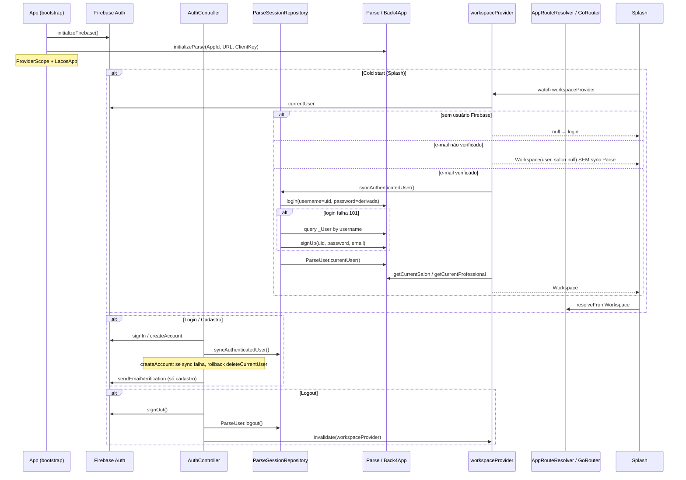

# Sprint T1 — Auditoria de Segurança Firebase ↔ Parse / Back4App

**Projeto:** Laços  
**Data:** 2026-07-27  
**Escopo:** diagnóstico apenas — nenhum arquivo de produção alterado além deste relatório.  
**Método:** leitura do código-fonte do repositório. Nenhuma configuração do painel Back4App foi inspecionada. Nenhum ataque foi executado.

**Legenda de confiança:**

| Selo | Significado |
|------|-------------|
| **CONFIRMADO NO CÓDIGO** | Observável diretamente no repositório |
| **INFERÊNCIA TÉCNICA** | Consequência plausível do código + comportamento conhecido de SDKs; não é fato de painel |
| **NÃO FOI POSSÍVEL CONFIRMAR** | Depende de Back4App, Firebase Console, dispositivo ou runtime |

---

## Resumo executivo

O Laços autentica identidade com **Firebase Auth** e sincroniza um `_User` Parse cujo `username` é o **Firebase UID** e cuja senha é a string **determinística** `lacos_parse_session_v1_<uid>` (`ParseSessionRepository._buildParsePassword`). O login Parse ocorre **no cliente**, com Application ID + Client Key embutidos no app. Não há Cloud Code, ParseACL, validação de Firebase ID Token no servidor, nem rotação de credencial Parse no repositório.

**Proteção de tenancy no app:** repositórios Dart filtram por `salon` (e, no caso de Salon, por `owner`) e, em várias mutações, buscam o objeto com `objectId` + `salon` antes de salvar. Em Appointments, outro salão é tratado como `AppointmentNotFoundException`.

**Lacuna crítica de evidência:** se Class Level Permissions (CLP) / ACL no Back4App permitirem que qualquer usuário autenticado faça `find`/`get`/`update` em classes de negócio sem restrição por ACL de objeto, os filtros Dart **não impedem** consulta direta à API Parse fora do Flutter. Isso **não pode ser confirmado nem refutado** só com o repositório.

**Resposta à pergunta de produção (seção 18):**  
**NÃO É POSSÍVEL CONFIRMAR SEM AUDITAR O PAINEL BACK4APP.**

---

## 1. Fluxo completo de autenticação

### Diagrama de sequência



### Etapas detalhadas

| Etapa | Arquivo | Classe / método | Entrada | Saída | Dados sensíveis | Efeitos colaterais | Falhas / retry |
|-------|---------|-----------------|---------|-------|-----------------|--------------------|----------------|
| App start | `lib/app/bootstrap.dart` `bootstrap()` | Firebase + Parse init | — | App rodando | — | `WidgetsFlutterBinding` | Firebase: loga e segue se UnsupportedError; Parse: sem try/catch local |
| Firebase init | `lib/core/config/firebase_bootstrap.dart` `initializeFirebase()` | `Firebase.initializeApp(DefaultFirebaseOptions)` | platform options | `isFirebaseInitialized` | apiKey, appId, projectId | flag global | debugPrint em erro |
| Parse init | `lib/core/config/parse_bootstrap.dart` `initializeParse()` | `Parse().initialize` | AppId, URL, ClientKey | SDK pronto | AppId, ClientKey | `autoSendSessionId: true`, `debug: kDebugMode` | Sem retry |
| Splash | `lib/features/splash/presentation/pages/splash_page.dart` | `workspaceProvider` | — | rota | — | navegação pós 1.5s | retry via invalidate |
| Workspace | `lib/core/workspace/application/providers/workspace_providers.dart` | `workspaceProvider` | Firebase currentUser | `Workspace?` | uid, email | chama `syncAuthenticatedUser` se e-mail verificado | propaga erros |
| Sign-in | `auth_controller.dart` `signIn` → `FirebaseAuthRepository.signIn` → `syncAuthenticatedUser` | email/senha Firebase | `AuthAuthenticated` | senha Firebase (transitória) | sessão Firebase + Parse | erro → `AuthError` |
| Cadastro | `createAccount` | email/senha | user + sync Parse + verification email | senha Firebase | se Parse falha: `deleteCurrentUser` + `signOut` Firebase | rollback best-effort |
| Verify e-mail | `reloadCurrentUser` / `resendVerificationEmail` | — | user atualizado | — | só Firebase | não re-sync Parse no reload |
| Sync Parse | `ParseSessionRepository.syncAuthenticatedUser` | Firebase user | sessão Parse | uid, email, **senha derivada** | login ou signUp Parse | FormatException genérica |
| Login Parse | `_loginOrCreateParseUser` | username=uid, password=derivada | success ou create | **credencial previsível** | `ParseUser.login()` | se 101 e user existe sem login → FormatException (sem recovery) |
| Query user exists | `_parseUserExists` | username | bool | uid | query `_User` do cliente | depende CLP |
| Sessão Parse | SDK (`ParseUser.currentUser`) | — | ParseUser | **session token** (SDK) | persistência local do SDK | **INFERÊNCIA:** SharedPreferences (testes mockam SP) |
| Logout | `AuthController.signOut` | — | bool | — | Firebase signOut **antes** de Parse logout; invalidate workspace só se ambos OK | se Parse falha após Firebase: dessincronia |

---

## 2. Ponte Firebase → Parse

### Respostas objetivas

| Pergunta | Resposta | Confiança |
|----------|----------|-----------|
| Como Firebase associa ao `_User` Parse? | `username` Parse = `AuthenticatedUser.id` (Firebase UID); e-mail gravado no signUp | **CONFIRMADO NO CÓDIGO** |
| Identidade comum? | Firebase UID ↔ `ParseUser.username` | **CONFIRMADO NO CÓDIGO** |
| Senha Parse derivada do UID? | Sim | **CONFIRMADO NO CÓDIGO** |
| Fórmula exata? | `'lacos_parse_session_v1_$uid'` em `_buildParsePassword` | **CONFIRMADO NO CÓDIGO** |
| Previsível? | Sim, dado o UID e o código/fonte/binário | **CONFIRMADO NO CÓDIGO** |
| Permanece igual indefinidamente? | Sim — sem versão/rotação no código | **CONFIRMADO NO CÓDIGO** |
| Existe rotação? | Não | **CONFIRMADO NO CÓDIGO** |
| Existe Cloud Code? | Nenhum `ParseCloud` / pasta cloud / `runFunction` no repo | **CONFIRMADO NO CÓDIGO** (ausência) |
| Token temporário? | Não | **CONFIRMADO NO CÓDIGO** |
| Validação server-side do Firebase ID Token? | Não no repositório | **CONFIRMADO NO CÓDIGO** (ausência) |
| UID conhecido ⇒ credenciais Parse? | Username = UID; password = fórmula acima | **CONFIRMADO NO CÓDIGO** |
| Client Key suficiente para login Parse? | App inicializa com Client Key e chama `login()`/`signUp()` no cliente | **CONFIRMADO NO CÓDIGO** que o app faz isso; se o servidor **aceita** login só com Client Key depende do painel | misto: uso **CONFIRMADO**; aceitação server **NÃO FOI POSSÍVEL CONFIRMAR** (mas o app em produção pressupõe que funciona) |
| Login direto do app cliente? | Sim | **CONFIRMADO NO CÓDIGO** |

**Trecho central** (`lib/core/session/infrastructure/repositories/parse_session_repository.dart`):

```dart
final username = firebaseUser.id;
final password = _buildParsePassword(username);
final loginResponse = await ParseUser(username, password, null).login();
// ...
String _buildParsePassword(String uid) {
  return 'lacos_parse_session_v1_$uid';
}
```

**TODO explícito no código:** substituir por Cloud Code / Auth Adapter / token customizado.

---

## 3. Secrets e configurações

| Item | Arquivo (aprox.) | Versionado? | Natureza | Extraível do app? | Impacto se exposto |
|------|------------------|-------------|----------|-------------------|--------------------|
| Parse Application ID | `lib/core/config/app_environment.dart:3` | Sim (`git ls-files`) | Identificador de app (público por natureza em apps clientes) | Sim | Identifica o backend; sozinho não autentica |
| Parse Client Key | `app_environment.dart:5` | Sim | **Chave de cliente** — autoriza chamadas como cliente Parse; **não** é Master Key | Sim | Com CLP permissivas + credenciais, permite API client; **não** equivale a master |
| Parse Server URL | `app_environment.dart:7` | Sim | Config pública | Sim | Aponta endpoint |
| Firebase apiKey (Android/iOS) | `lib/firebase_options.dart:21,29` | Sim | API key de cliente Firebase (restrita por app/project rules) | Sim | Identifica projeto; abuso depende de App Check / Auth rules |
| Firebase appId, projectId, senderId | `firebase_options.dart` | Sim | Identificadores | Sim | Baixo isoladamente |
| `google-services.json` | `android/app/google-services.json` | Sim | Config cliente | Sim | Idem Firebase |
| `GoogleService-Info.plist` | `ios/Runner/GoogleService-Info.plist` | Sim | Config cliente | Sim | Idem |
| Senha Parse derivada | `_buildParsePassword` | Sim (fórmula) | **Credencial crítica derivável** | Sim (fórmula no binário) | Permite login Parse se UID conhecido |
| Master Key | — | Não no repo | Segredo server-side | N/A | **NÃO FOI POSSÍVEL CONFIRMAR** se existe no painel |
| REST Key / JS Key extras | — | Não no repo | — | — | **NÃO FOI POSSÍVEL CONFIRMAR** |
| `.env` / dart-define / flavors | TODO em `app_environment.dart`; sem flavors no `pubspec` | N/A | — | — | Um único backend hardcoded |
| `flutter_secure_storage` | Ausente do `pubspec.yaml` | — | — | — | Sessões não em secure enclave via app |
| `.gitignore` | Sem regras para `.env`, keys, `google-services` | — | — | — | Configs cliente estão versionadas de propósito atual |

**Diferenciação obrigatória:**

- **Chave pública de cliente:** Firebase API key, Parse Application ID, Server URL.  
- **Chave de cliente privilegiada (não master, mas sensível ao modelo de ameaça):** Parse Client Key — esperada no app, mas amplia superfície se CLP for aberta.  
- **Credencial crítica:** senha Parse derivável; session token em runtime.  
- **Segredo server-side:** Master Key — **não** deve estar no app; **não** encontrada no repo.

**Nota sobre dart-define:** mover Client Key para `--dart-define` **não** a torna secreta; continua no binário. Serve para **separar ambientes**, não para confidencialidade.

---

## 4. Sessões e tokens

| Pergunta | Resposta | Risco |
|----------|----------|-------|
| Onde sessão Firebase persiste? | SDK Firebase Auth (persistência nativa da plataforma) | Informacional |
| Onde sessão Parse persiste? | Via SDK Parse (`ParseUser.currentUser`); testes usam `SharedPreferences.setMockInitialValues` ao inicializar Parse → **INFERÊNCIA TÉCNICA:** persistência em SharedPreferences / storage do SDK | Médio (armazenamento não “secure”) |
| Session token Parse? | Sim, gerenciado pelo SDK; `autoSendSessionId: true` | Informacional |
| Armazenamento manual de token? | Não no código do app | Informacional |
| Secure storage? | Pacote ausente | Médio |
| Logout invalida as duas? | Tenta Firebase depois Parse; **não atômico** | Alto (dessincronia) |
| Firebase sai, Parse permanece? | **Sim, possível:** `signOut` chama Firebase primeiro; se Parse `logout` falha, retorna `false` e **não** invalida workspace — mas Firebase já saiu. Stream Auth → unauthenticated; Parse pode ainda ter session local/servidor | **Alto** — **CONFIRMADO NO CÓDIGO** (ordem + early return só se Parse user null) |
| Parse sai, Firebase permanece? | Ordem atual torna o inverso menos provável no happy path; se só `sessionRepository.signOut` fosse chamado isoladamente, sim — não há fluxo UI assim | Baixo |
| Recupera Parse sem revalidar Firebase? | Cold start: workspace só sync se `currentUser` Firebase existe e e-mail verificado. Se Firebase null, não sync. Porém session Parse residual no disco **pode** existir até novo sync/logout — **INFERÊNCIA** | Médio |
| E-mail não verificado mantém sessão Parse? | **Cadastro** chama `syncAuthenticatedUser` **antes** de `sendEmailVerification` → Parse user criado mesmo sem verificar. Workspace **não** re-sync enquanto não verificado, mas sessão Parse do signUp pode persistir | Médio — **CONFIRMADO** criação antecipada |
| Revogação senha Firebase invalida Parse? | Não há vínculo server-side no código; Parse password independente | **Alto** (desenho) |
| Delete user Firebase ↔ Parse? | Rollback só no createAccount falho; sem sync de exclusão contínua | Médio |
| Offline? | SDKs podem servir currentUser cacheado; comportamento exato **NÃO FOI POSSÍVEL CONFIRMAR** sem runtime | Informacional |

---

## 5. Tenancy — mapa e matriz

### Campos por entidade (domínio / Persistência)

| Entidade | `salon` / salonId no Parse | `owner` / ownerId | Notas |
|----------|----------------------------|-------------------|-------|
| Salon | N/A (é o tenant) | `owner` pointer no create/query | `getCurrentSalon` **não** filtra `isActive` |
| Professional | `salon` pointer | **Não seta owner** no create | `getCurrentProfessional` = first active do salon |
| Client | `salon` + owner no create | owner | update/delete: objectId + salon |
| Service | salon + owner | owner | idem |
| Appointment | salon + owner no create | owner | mutações: fetch + compara `salonId` |
| AppointmentService | salon + owner | owner | queries por appointment + salon |
| ClientMemory | salon + owner | owner | objectId + salon + isActive |
| ServiceRecord | salon + owner | owner | queries salon + isActive |
| ServiceRecordService | salon + owner | owner | idem |

### Matriz Repository × operação

Legenda: **S** = filtra/define salon da sessão; **O** = usa owner da sessão no write; **A** = isActive; **F** = fetch fresco com salon; **—** = N/A ou ausente.

| Repository | findAll / list | findById / get | create | update | delete | salon check | owner check |
|------------|----------------|----------------|--------|--------|--------|-------------|-------------|
| ParseSalonRepository | getCurrent: owner + limit 1 | — | owner atual | — | — | via owner | **sim** (query) |
| ParseProfessionalRepository | salon + isActive | getCurrent: salon + isActive | salon atual; **sem owner** | — | — | **S** | **não** |
| ParseClientRepository | salon + isActive | — (sem findById) | **S+O+A** | **F** objectId+salon | soft **F** + isActive false | **S** | write only |
| ParseServiceRepository | salon + isActive | — | **S+O+A** | **F** | soft **F** | **S** | write only |
| ParseAppointmentRepository | findByDay/range: salon + isActive | getObject + **salonId == current** | **S+O** (salon do current, não do DTO) | **F** + salon + isActive + canBeEdited | cancel/complete: salon check | **S** pós-fetch | write on create |
| ParseAppointmentServiceRepository | by appointment + salon + isActive | — | **S+O** | — | soft deleteByAppointment + salon | **S** | write |
| ParseClientMemoryRepository | by client + salon + isActive | via query objectId+salon | **S+O** | **F** | soft **F** | **S** | write |
| ParseServiceRecordRepository | by appointment/client + salon + isActive | — | **S+O** | — | — | **S** | write |
| ParseServiceRecordServiceRepository | by record + salon + isActive | — | **S+O** | — | — | **S** | write |

**Confiança em IDs da UI:** clientId / professionalId / serviceId / appointmentId vêm da UI; **salon/owner de escrita** são sobrescritos pela sessão nos creates observados. Em update de appointment, `salonId`/`ownerId` do DTO **não** são aplicados pelo mapper (`applyUpdate` só client/professional/start/end/notes) — **CONFIRMADO**.

**Outro salão:** Clients/Services/Memories → query vazia → erro de update/delete genérico. Appointments → `AppointmentNotFoundException`.

---

## 6. ACL, CLP e proteção server-side

### No repositório — CONFIRMADO

| Item | Presente? |
|------|-----------|
| `ParseACL` / `setACL` | **Não** (grep zero) |
| Roles | **Não** |
| Cloud Code / beforeSave / beforeFind | **Não** |
| Master key no app | **Não** |
| LiveQuery | **Não** |
| Schema export / scripts CLP | **Não** |
| Protected fields no código | **Não** |

**Conclusão de código:** a autorização de tenancy **implementada e versionada** está nos **filtros Dart** dos repositories. Qualquer proteção real contra cliente malicioso **depende** de CLP/ACL/Cloud Code no Back4App — **fora deste repositório**.

### VERIFICAÇÃO MANUAL NECESSÁRIA NO BACK4APP

O desenvolvedor deve abrir o painel Back4App do app `app-lacos` / Application ID do `app_environment.dart` e conferir **sem assumir valores**:

1. **App Settings → Security & Keys**  
   - Client Key vs Master Key (Master nunca no app).  
   - Quais keys estão ativas; rotação; restrição por domínio se houver.

2. **Core → Users (`_User`)**  
   - CLP: Find, Get, Create, Update, Delete, Add fields.  
   - Quem pode fazer Find em `_User` (a app faz query por username).  
   - Password storage / login allowed.

3. **Database Browser → cada classe** (Client, Service, Appointment, AppointmentService, ClientMemory, ServiceRecord, ServiceRecordService, Salon, Professional):  
   - **Class Level Permissions** para Authenticated / Public / Roles.  
   - **Protected Fields** (salon, owner, isActive, status, etc.).  
   - Se objetos têm **ACL** por objeto (Owner + read/write).  
   - Índices em `salon`, `owner`, `startAt`, `client`.

4. **Cloud Code**  
   - Funções existentes? beforeSave? validação de Firebase token?

5. **Webhooks / Jobs / Session settings**  
   - Expiração de session token; invalidação.

6. **Parse Dashboard → Logs**  
   - Chamadas REST anômalas; logins por username=UID.

**Não inventar** o estado atual do painel — apenas checklist.

---

## 7. Cenários de ataque (conceituais — sem exploração)

| ID | Cenário | Pré-condições | Barreiras atuais | Barreiras ausentes | Impacto | Prob. | Sev. | Evidência | Depende painel? |
|----|---------|---------------|------------------|--------------------|---------|-------|------|-----------|-----------------|
| A | Consultar Clients de outro salão via app | User autenticado | `findAll` filtra salon | CLP pode permitir find amplo via REST | Vazamento PII | Média se CLP aberta | Alta | `ParseClientRepository.findAll` | **Sim** |
| B | Alterar salon pointer na request | Sessão + Client Key | Creates usam salon da sessão; updates re-fetch com salon | Sem beforeSave; cliente pode tentar save direto | Cross-tenant write | Média se CLP allow update | Crítica se possível | repos create/update | **Sim** |
| C | Conhecer Firebase UID da vítima | UID + AppId + ClientKey | Firebase password **não** necessária para Parse | Senha Parse = fórmula pública no código | **Account takeover Parse** da vítima | Média (UID leak) | **Crítica** (desenho) | `_buildParsePassword` | Parcial (login deve ser aceito — app pressupõe que é) |
| D | Extrair AppId + ClientKey do APK | Binário | Nenhuma ofuscação relevante | Keys são de cliente | Facilita A–C/G | Alta | Médio–Alto | `app_environment.dart` versionado | Não |
| E | Session Parse após logout Firebase | Logout com falha Parse | Idealmente ambos | Ordem Firebase→Parse; invalidate só no sucesso | Sessão Parse órfã | Média | Alto | `AuthController.signOut` | Não |
| F | Objeto criado sem ACL | Qualquer create | — | App nunca seta ACL | Objeto herda só CLP | Alta | Depende CLP | grep ACL vazio | **Sim** |
| G | Chamar API Parse fora do Flutter | Keys + sessão ou credencial derivada | Filtros Dart irrelevantes | Sem Cloud Code | Bypass total da UI | Alta se CLP frouxa | Crítica se CLP frouxa | arquitetura client-side | **Sim** |
| H | Professional `isActive=false` | Soft flag | `findAll`/`getCurrent` filtram isActive | Sem desligar `_User`/Firebase; user ainda autentica | Acesso residual ao tenant | Média | Médio | `ParseProfessionalRepository` | Parcial |

---

## 8. Autorização por operação crítica

Padrão geral — **CONFIRMADO:**

- **Quem chama:** qualquer usuário com sessão Firebase + Parse que passou no onboarding (UI); **não** há roles no app.  
- **Identidade:** `ParseUser.currentUser()` + `SalonRepository.getCurrentSalon()`.  
- **Tenancy UI:** UI **não** envia salonId para create de client/service; repository carimba.  
- **Server-side:** **não versionada** no repo.  
- **Mass assignment:** limitado nos mappers de update de appointment; clients/services setam campos explícitos.  
- **Troca de pointer salon:** bloqueada nos caminhos Dart de create; update de appointment não grava salon.

| Ação | Proteção Dart | Risco residual |
|------|---------------|----------------|
| Criar/editar/excluir cliente | salon da sessão; update/delete com objectId+salon | Bypass REST se CLP permitir |
| Criar/editar serviço | idem | idem |
| Criar appointment | salon/owner da sessão; disponibilidade no use case | client/professional IDs da UI (confiança no catálogo) |
| Editar appointment | canBeEdited + salon check + applyUpdate restrito | sync serviços não atômico (integridade, não auth) |
| Cancelar/concluir | status rules + salon | idem |
| Memórias CRUD/arquivo | salon + isActive | idem |
| Ler ServiceRecord | salon + isActive | idem |

---

## 9. Cadastro e onboarding

```text
Firebase createAccount
→ syncAuthenticatedUser (Parse login/signUp)   [ANTES de verificar e-mail]
→ sendEmailVerification
→ (splash/workspace) se verificado: salon? → professional? → home
```

| Cenário | Comportamento — CONFIRMADO / INFERÊNCIA |
|---------|----------------------------------------|
| Firebase OK, Parse falha | Rollback: `deleteCurrentUser` + `signOut` Firebase; log debug | **CONFIRMADO** |
| Parse OK, Salon falha | Usuário autenticado sem salon → welcome/create-salon; Parse user permanece | **CONFIRMADO** fluxo |
| Salon OK, Professional falha | Rota complete-profile; salon órfão de professional | **CONFIRMADO** |
| Retry onboarding | getCurrentSalon limit 1; create salon de novo pode **duplicar** salons do mesmo owner se CLP permitir — **INFERÊNCIA** (código não impede segundo create) | Atenção |
| App fecha no meio | Estado parcial persistido (Firebase e/ou Parse e/ou Salon) | **CONFIRMADO** possível |
| Logout no onboarding | Mesmo fluxo signOut | Dessincronia se Parse logout falha |
| E-mail não verificado | Parse já pode existir; workspace **não** chama sync até verificar | **CONFIRMADO** |
| Novo dispositivo | Firebase login → sync Parse com **mesma senha derivada** → recupera sessão | **CONFIRMADO** |

TODO em `parse_salon_repository.create`: comentário desatualizado (“sincronizar sessão Firebase→Parse quando pronto”) — a sync já existe em `ParseSessionRepository`.

---

## 10. Logout e revogação

**Ordem atual** (`AuthController.signOut`):

1. `authRepository.signOut()` (Firebase)  
2. `sessionRepository.signOut()` (Parse logout)  
3. `ref.invalidate(workspaceProvider)` **somente se ambos OK**

| Pergunta | Resposta |
|----------|----------|
| Idempotente? | Parse: se `currentUser == null`, return OK. Firebase signOut tipicamente idempotente. Controller em erro fica `AuthError` | Parcial |
| Parse logout falha → Firebase sai? | **Sim** (já saiu) | **CONFIRMADO** |
| Firebase falha → Parse sai? | Não chega a Parse | **CONFIRMADO** |
| Providers do salão em memória? | invalidate workspace no sucesso; **outros** FutureProviders (clients, appointments) **não** são limpos globalmente no logout | **CONFIRMADO** lacuna |
| IndexedStack? | Shell mantém tabs; após novo login no mesmo processo, providers podem servir cache antigo até invalidate/rebuild | **Médio** — risco de vazamento UX entre usuários no **mesmo** device/session de app |
| Outro usuário vê cache? | Possível se login B sem matar ProviderScope / sem invalidar listas | **Médio** |

---

## 11. Logs e vazamento

| Local | O que loga | Classificação |
|-------|------------|---------------|
| `AuthController._debugLog` (só `kDebugMode`) | mensagens de rollback; **pode incluir `syncError` toString** | **Atenção** |
| Appointment create/update/complete controllers | status de fluxo; `error` / `cause` | **Atenção** (não token; pode vazar IDs/mensagens Parse) |
| Form / dialog appointment | errorMessage amigável | Seguro / atenção baixa |
| `firebase_bootstrap` | código de erro config | Seguro |
| `parse_bootstrap` `debug: kDebugMode` | SDK pode logar requests em debug | **Atenção** em builds debug |
| Senha / session token em logs | **Não encontrado** print explícito da senha derivada | Seguro nesse ponto |
| Release | `debugPrint` no-op em release Flutter típico | Informacional |

Nenhum log de Master Key. Senha derivada **não** é impressa — mas está no **código**.

---

## 12. Dependências e build

| Item | Estado — CONFIRMADO |
|------|---------------------|
| firebase_core | ^4.11.0 |
| firebase_auth | ^6.5.4 |
| parse_server_sdk_flutter | ^10.7.0 |
| flutter_riverpod | ^2.6.1 |
| shared_preferences | ^2.5.5 (**dev_dependency**; SDK Parse puxa transitivamente em runtime de testes) |
| flutter_secure_storage | Ausente |
| Flavors / dart-define | Ausentes; TODO em AppEnvironment |
| Prod vs dev backend | **Mesmo** AppId/URL/ClientKey hardcoded → um único Back4App |
| Trocar config sem recompilar | Não |
| Secrets no binário | AppId, ClientKey, Firebase options, fórmula de senha | Sim |

---

## 13. Testes de segurança existentes

| Regra | Tem teste? | Camada | Arquivo | Lacuna |
|-------|------------|--------|---------|--------|
| Sessão Firebase↔Parse | Não | — | — | Sem teste de `ParseSessionRepository` |
| Login / logout | Não (feature auth) | — | só `test/helpers/fake_auth_repository.dart` | Sem auth feature tests |
| Onboarding salon/professional | Não | — | — | — |
| Appointment outro salão → NotFound | **Sim** | Infra | `parse_appointment_repository_test.dart` | Bom para appointments; não cobre Clients/Services/Memories |
| ACL | Não | — | — | — |
| Owner isolation | Indireto via fakes | — | — | Sem teste de bypass |
| Usuário inativo / professional inactive | Não auth | — | — | — |
| E-mail não verificado + Parse | Não | — | — | — |
| Falha parcial logout | Não | — | — | — |
| Senha derivável | Não | — | — | — |

**Nota:** testes de “outro salão” em appointments são **autorização de repository**, não prova de CLP server-side.

---

## 14. Achados classificados

| ID | Título | Tipo | Sev. | Prob. | Impacto | Explorabilidade | Depende Back4App? | Urgente? | Bloqueia produção? | Evidência |
|----|--------|------|------|-------|---------|-----------------|-------------------|----------|--------------------|-----------|
| T1-01 | Senha Parse determinística a partir do Firebase UID | Risco **confirmado** | **Crítico** | Média–Alta se UID vaza | Account takeover da identidade Parse | Alta com keys do app + UID | Parcial (login precisa funcionar — e o app depende disso) | **Sim** | **Sim** (multi-tenant) | `parse_session_repository.dart` `_buildParsePassword` |
| T1-02 | Login Parse 100% no cliente sem validar Firebase ID Token | Risco **confirmado** (desenho) | **Alto** | Alta (é o desenho) | Desacopla auth Firebase de auth dados | Alta | Não para o desenho | Sim | Sim para escala | `syncAuthenticatedUser` |
| T1-03 | Sem ACL/Cloud Code versionados; tenancy só no Dart | Risco **provável** até auditar painel | **Alto** (se CLP aberta) / Informacional (se CLP/ACL corretas) | Depende painel | Cross-tenant | Alta se CLP frouxa | **Sim** | Auditar painel já | Condicional | grep ACL/Cloud vazio |
| T1-04 | Client Key + AppId no source e no binário | Informacional / Médio | Médio | Alta (extração trivial) | Facilita API client | Alta | Não | Documentar + ambientes | Não sozinho | `app_environment.dart` |
| T1-05 | Logout Firebase antes de Parse; cache Riverpod não limpo | Risco **confirmado** | Alto (sessão) / Médio (cache) | Média | Sessão Parse residual; leak UX multi-user device | Média | Não | Sim (baixo risco de patch) | Não isolado | `AuthController.signOut` |
| T1-06 | Parse user criado antes de e-mail verificado | Risco **confirmado** | Médio | Alta (todo cadastro) | Contas Parse órfãs / abuso de criação | Média | Não | Médio | Não | `createAccount` |
| T1-07 | `getCurrentSalon` sem filtro `isActive` | Risco **confirmado** | Baixo | Baixa | Salon “inativo” ainda resolve | Baixa | Não | Baixo | Não | `parse_salon_repository.dart` |
| T1-08 | Professional sem `owner`; first-active | Risco **confirmado** | Médio | Média multi-pro | Ambiguidade de identidade profissional | Baixa hoje (single) | Não | Quando multi-pro | Não agora | `parse_professional_repository.dart` |
| T1-09 | Query `_User` por username no cliente | Risco **confirmado** uso | Médio | Depende CLP Find em `_User` | Enumeração de UIDs | Média | **Sim** | Auditar CLP `_User` | Condicional | `_parseUserExists` |
| T1-10 | Um único backend prod/dev | Risco **confirmado** | Médio | Alta | Dados reais em dev builds | Alta | Não | Sim para governança | Recomendado | `AppEnvironment` |
| T1-11 | Zero testes de sessão/auth | Lacuna | Médio | — | Regressão silenciosa | — | Não | Sim | Não | ausência test/auth |

**Não inflar:** Firebase API keys versionadas são **esperadas** em apps móveis; severidade sobe só se regras Firebase forem frouxas (**NÃO FOI POSSÍVEL CONFIRMAR** no console).

---

## 15. Chaves públicas vs segredos

| Valor | Origem | Público por natureza? | Extraível do app? | Impacto | Ação |
|-------|--------|----------------------|-------------------|---------|------|
| Firebase API key | `firebase_options.dart` | Sim (cliente) | Sim | Baixo se Auth/App Check OK | Restringir no Google Cloud; App Check |
| Parse Application ID | `app_environment.dart` | Sim | Sim | Identifica app | OK no cliente; separar ambientes |
| Parse Client Key | `app_environment.dart` | “Client secret” fraco — **não** master | Sim | Habilita API como cliente | Aceitável no app **somente** com CLP/ACL rígidas |
| Server URL | `app_environment.dart` | Sim | Sim | Endpoint | Separar staging/prod |
| Master Key | Não no repo | **Nunca** pública | N/A | Controle total | Manter só server/CI; nunca app |
| Senha `lacos_parse_session_v1_<uid>` | Código | **Não** — é credencial | Fórmula sim | Takeover Parse | **Substituir** (T1.2) |
| Session token | Runtime SDK | Não | Em storage local | Impersonação até expirar | Logout robusto; secure storage |

**dart-define não “esconde” segredo de cliente.** Qualquer valor compilado no app é extraível.

---

## 16. Checklist manual do Back4App

Para **cada** classe abaixo, no painel: anotar CLP (Public / Authenticated / Role) para Find, Get, Create, Update, Delete, AddField; Protected Fields; se objetos novos ganham ACL; índices.

### Princípio esperado (recomendação — **não aplicar nesta sprint**)

| Classe | Princípio esperado |
|--------|--------------------|
| `_User` | Create via signUp controlado; **Find** público/autenticado o mais restrito possível; Update só self; sem Delete client-wide |
| `Salon` | Create autenticado; Find/Get só via ACL owner ou pointer; Update só owner |
| `Professional` | Restrito ao salon (ACL ou Cloud Code); sem Find global autenticado |
| `Client` | Autenticado **não** basta: ACL por salon/owner ou beforeFind forçando salon; Protected: `salon`, `owner`, `isActive` |
| `Service` | Idem Client |
| `Appointment` | Idem; Protected: `status`, `salon`, `owner`, `completedAt`, `canceledAt` |
| `AppointmentService` | Idem; sem Delete hard pelo cliente se soft-delete |
| `ClientMemory` | Idem; dados sensíveis — preferir ACL estrita |
| `ServiceRecord` / `ServiceRecordService` | Idem; histórico clínico — Find restrito |

Repetir mentalmente o mesmo checklist para **ClientMemory** (Find/Get/Create/Update/Delete/AddField/protectedFields/ACL/índices) e demais classes da tabela.

---

## 17. Proteções existentes vs ausentes

### Já existentes (código)

- Firebase como identidade primária (email/senha).  
- Sync Parse após login/cadastro.  
- Rollback Firebase se Parse falha no cadastro.  
- Gate de e-mail verificado no router/workspace (para entrar no produto).  
- Salon/owner carimbados na maioria dos creates.  
- Queries de negócio com filtro `salon` (+ `isActive` na maior parte).  
- Mutações clients/services/memories com `objectId` + `salon`.  
- Appointments: comparação `salonId` → NotFound.  
- Update appointment não altera status/histórico via mapper.  
- `autoSendSessionId` para requests autenticados.

### Ausentes (código)

- Validação Firebase ID Token no servidor.  
- Credencial Parse não derivável / rotacionável.  
- ParseACL / Roles / Cloud Code versionados.  
- Logout atômico e limpeza global de caches Riverpod.  
- Secure storage.  
- Ambientes separados.  
- Testes de auth/sessão/autorização cross-tenant (exceto appointments).  
- Desativação coordenada Firebase↔Parse↔Professional.

### Dependentes do painel (verificar)

- CLP reais.  
- ACL por objeto.  
- Protected fields.  
- Expiração de sessão.  
- Restrições de keys.  
- Cloud Code eventualmente já implantado fora do git.

---

## 18. Roadmap de correção (sem implementar)

### T1.1 — Correções imediatas de baixo risco

- Documentar este achado para o time (este arquivo).  
- Checklist Back4App executado e registrado.  
- Endurecer logout: Parse logout **antes** ou compensar; sempre invalidar providers de dados (clients, appointments, memories, workspace).  
- Evitar logs de erros brutos em auth em builds que vazem.  
- Testes unitários de `ParseSessionRepository` (fórmula documentada; comportamento login/signUp) e de logout parcial.  
- Testes de repository “outro salão” para Client/Service/Memory (espelhar appointments).

### T1.2 — Autenticação e sessão

- Eliminar senha derivável.  
- Validar Firebase ID Token em Cloud Code / Auth Adapter.  
- Emitir sessão Parse apenas server-side.  
- Rotação / invalidação alinhada a revogação Firebase.  
- Adiar criação Parse até e-mail verificado **ou** marcar usuário pending.

### T1.3 — Autorização e tenancy

- CLP mínimas + ACL por salon/owner em todas as classes de negócio.  
- Protected fields para `salon`, `owner`, `status`, timestamps de cancel/complete.  
- beforeFind/beforeSave rejeitando cross-tenant.  
- Roles se multi-profissional.

### T1.4 — Operação e governança

- Staging vs production Parse/Firebase.  
- Rotação de Client Key.  
- Monitoramento de logins `_User` e queries sem filtro salon.  
- Documentação de threat model.  
- Proibir Master Key em qualquer cliente.

---

## 19. Pergunta final

### “O Laços pode ser colocado em produção hoje sem expor dados entre salões?”

# NÃO É POSSÍVEL CONFIRMAR SEM AUDITAR O PAINEL BACK4APP

**Justificativa:**

1. **CONFIRMADO NO CÓDIGO:** o app **tenta** isolar tenancy com filtros `salon`/`owner` e checagens pós-fetch. Isso protege o **caminho feliz do Flutter**.  
2. **CONFIRMADO NO CÓDIGO:** não há ACL/Cloud Code no repositório; um cliente HTTP com Application ID + Client Key + sessão (ou credencial derivada do UID) **não é obrigado** a usar esses filtros.  
3. **NÃO FOI POSSÍVEL CONFIRMAR:** se as CLP/ACL do Back4App já restringem Find/Get/Update por usuário/objeto de forma a impedir cross-tenant.  
4. **Independentemente do painel:** a senha Parse derivável (**T1-01**) é um defeito de autenticação **confirmado** e deve ser tratado como bloqueador de produção multi-tenant responsável, mesmo que o isolamento de dados por CLP esteja perfeito.

Enquanto o painel não for auditado **e** T1-01 não for endereçado, não há base técnica para afirmar “SIM”.

---

## Apêndice — arquivos-chave

| Área | Paths |
|------|-------|
| Bootstrap | `lib/app/bootstrap.dart`, `lib/core/config/firebase_bootstrap.dart`, `lib/core/config/parse_bootstrap.dart` |
| Ambiente | `lib/core/config/app_environment.dart`, `lib/firebase_options.dart` |
| Sessão | `lib/core/session/infrastructure/repositories/parse_session_repository.dart` |
| Auth | `lib/features/auth/application/controllers/auth_controller.dart`, `lib/features/auth/infrastructure/repositories/firebase_auth_repository.dart` |
| Workspace / rotas | `lib/core/workspace/application/providers/workspace_providers.dart`, `lib/core/router/app_route_resolver.dart`, `lib/features/splash/presentation/pages/splash_page.dart` |
| Tenancy | `lib/features/*/infrastructure/repositories/parse_*.dart` |

---

*Fim da auditoria T1. Nenhum código de autenticação, nenhuma configuração Back4App e nenhum ataque foram executados. Apenas este documento de diagnóstico foi produzido.*
